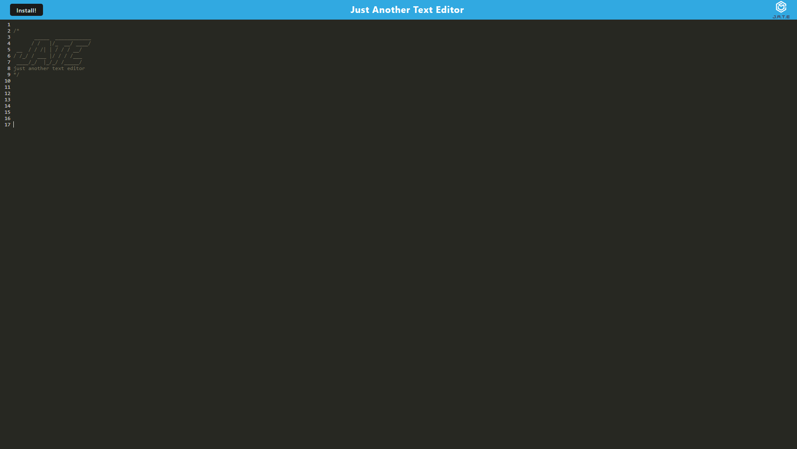
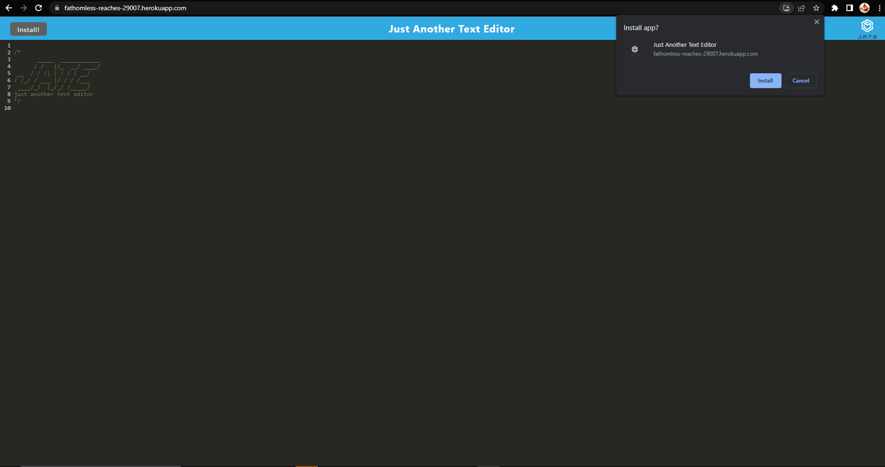
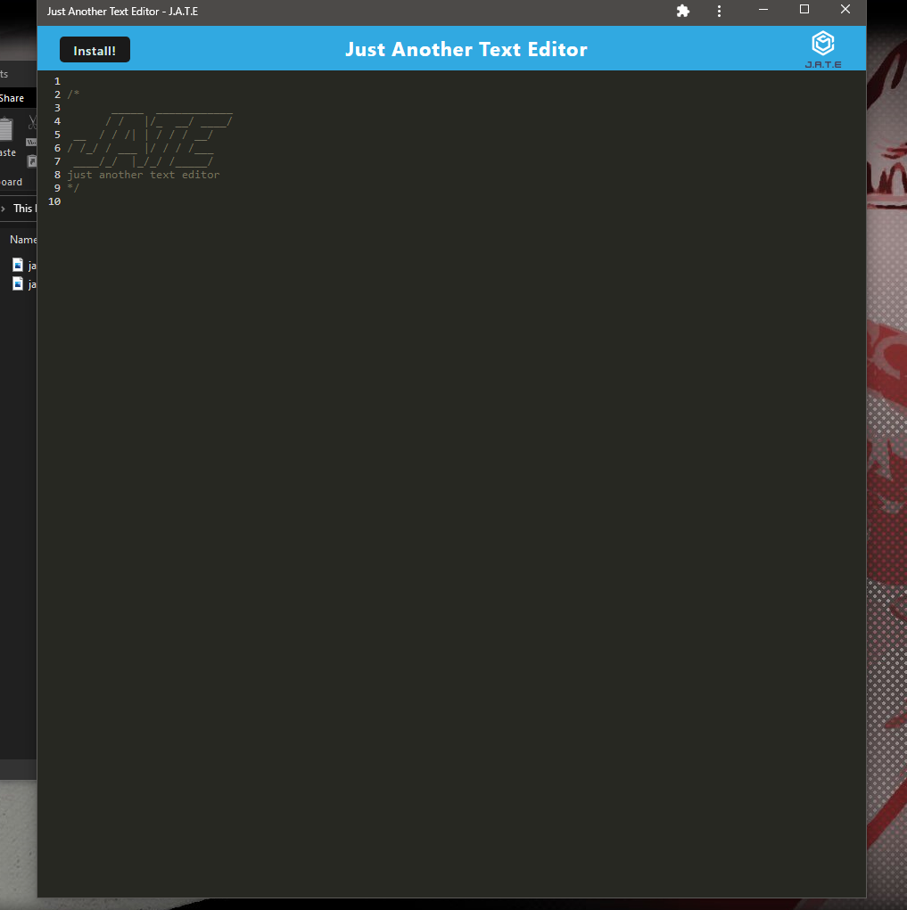

# Text Editor

## Description

[Heroku Deployment](https://fathomless-reaches-29007.herokuapp.com/)

This is a simple, pre-built browser text editor that functions as a **P**rogressive **W**eb **A**pplication. It runs on IndexedDB through the npm library idb. The app is bundled through Webpack for easy user functionality, with modules from Workbox for the Service Workers.

## Usage

`npm i`

`npm run client`

Through the Heroku app, no commands need to be run and the app can be used just by typing into the editor.

## Documentation

